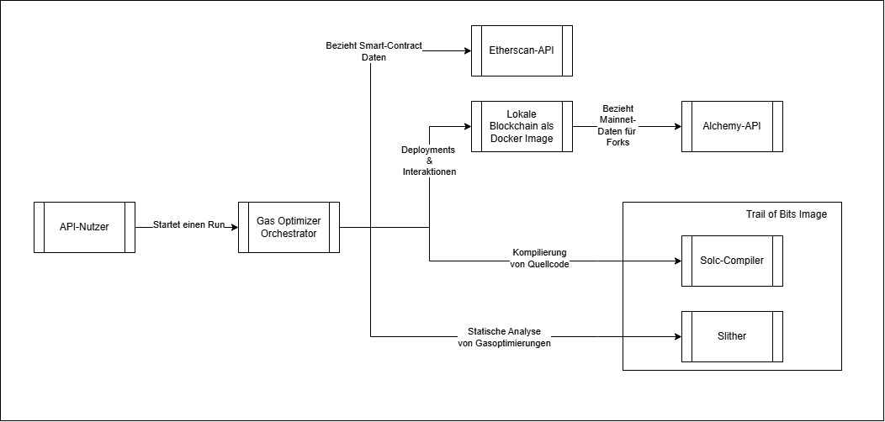
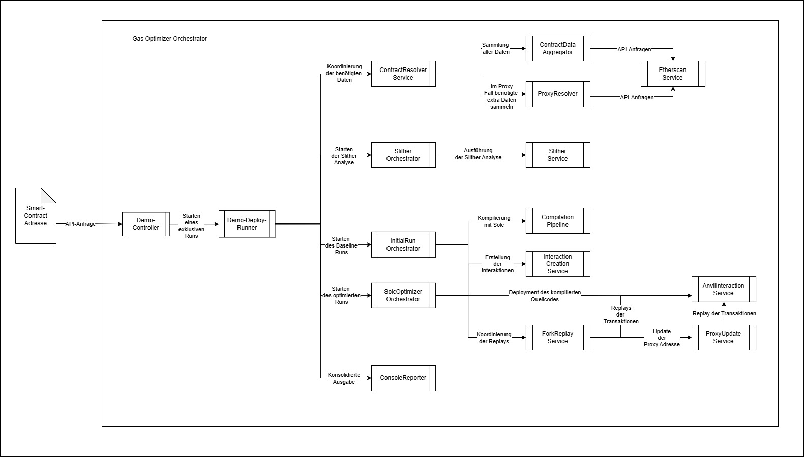
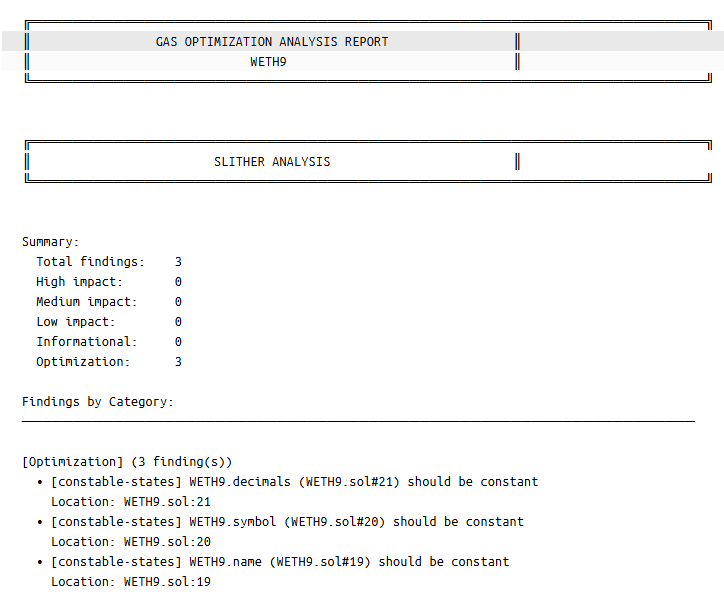
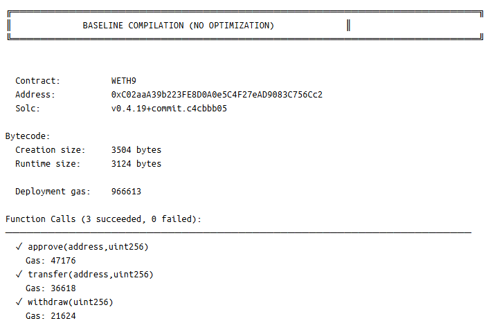
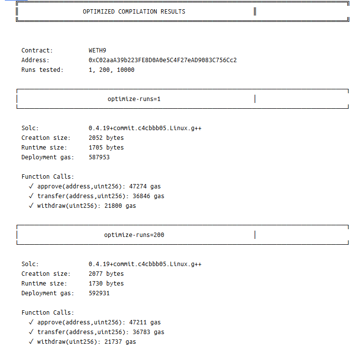
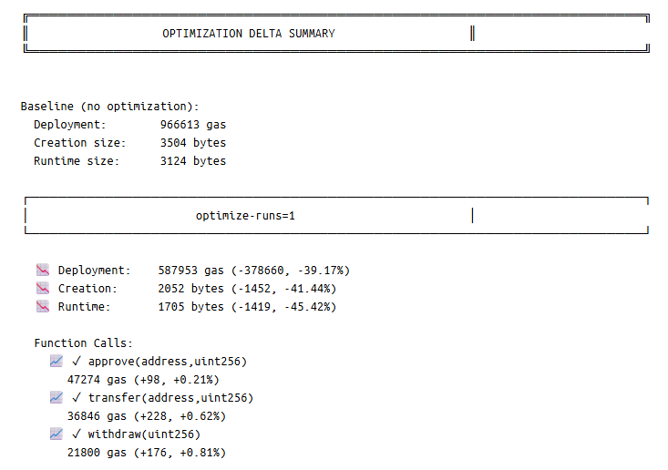

## 1. Kurze Systembeschreibung

Der **Gas Optimizer Orchestrator** ist eine containerisierte **Spring-Boot-Anwendung (Kotlin)**, die einen **End-to-End-Workflow** zur **vergleichenden Messung von Gas-Kosten** für Ethereum Smart Contracts orchestriert. Ausgehend von einer Contract-Adresse beschafft das System verifizierten Quellcode und Metadaten (z. B. via Etherscan), erkennt **Direct- vs. Proxy-Contracts**, führt eine **statische Analyse (Slither)** aus, kompiliert den Contract als **Baseline** und als mehrere **Optimierungsvarianten** (z. B. unterschiedliche *optimizer-runs*, optional *via-IR*), und misst anschließend Gas-Kosten durch **Deployment + Replay** ausgewählter Transaktionen in einer **lokalen EVM-Fork-Umgebung (Anvil)**. Die Ergebnisse werden konsolidiert berichtet (Konsole + Artefakte im Shared Workspace).

---

## 2. Systemkontext und Nachbarsysteme

  

Ein interner API-Nutzer startet per HTTP-Request einen Run am **Gas Optimizer Orchestrator**. Der Orchestrator bezieht dafür verifizierte Smart-Contract-Daten über die **Etherscan-API**. Für Deployments und Interaktionen nutzt er eine **lokale Blockchain** als Docker-Image. Diese lokale Chain bezieht die benötigten Mainnet-Daten für Forks über die **Alchemy-API**. Die Kompilierung des Quellcodes sowie die statische Analyse laufen in einer containerisierten Toolchain innerhalb des **Trail of Bits**-Images, das den **Solc-Compiler** und **Slither** bereitstellt.

## 3. Bausteinsicht

  

### Level 1 – Gesamtsystem (Whitebox)

Der **Gas Optimizer Orchestrator** führt einen vollständigen Run für eine Contract-Adresse aus: Er löst die Adresse (Direct/Proxy) auf, analysiert den Contract, kompiliert ihn als **Baseline** und als **Optimierungsvarianten**, deployt die Ergebnisse in eine lokale EVM-Fork-Umgebung (**Anvil**) und misst die Gas-Kosten durch **Replay** ausgewählter Transaktionen. Am Ende werden die Ergebnisse konsolidiert ausgegeben.

---

### Level 2 – API Layer

#### DemoController
HTTP-Einstiegspunkt des Systems. Nimmt die Contract-Adresse entgegen, prüft/validiert die Eingaben und startet den Demo-Run.

---

### Level 3 – Run Coordination

#### DemoDeployRunner
Zentraler Ablauf-Taktgeber für den Demo-Run. Führt die Schritte in fester Reihenfolge aus (Resolution → Analyse → Baseline/Varianten → Deployment/Replay → Reporting) und stellt sicher, dass der Demo-Run nicht parallel zu einem anderen Demo-Run läuft.

---

### Level 4 – Fachliche Kernbausteine

#### ContractResolverService
Ermittelt, **was** genau hinter der angegebenen Adresse steckt (Direct Contract oder Proxy) und erzeugt eine konsistente „Resolution“ als Grundlage für alle weiteren Schritte.

#### SlitherOrchestrator
Steuert die **statische Analyse** des Contracts (Slither) und bereitet die Analyse-Ergebnisse/Artefakte so auf, dass sie im Run weiterverwendet und berichtet werden können.

#### InitialRunOrchestrator
Führt den **Baseline-Run** aus: kompiliert den Contract in der Baseline-Konfiguration, erzeugt die auszuführenden Interaktionen, deployt den Contract auf dem Fork und misst die Gas-Kosten beim Replay.

#### SolcOptimizerOrchestrator
Führt **Optimierungsvarianten** aus: kompiliert den Contract mit unterschiedlichen Optimizer-Konfigurationen (z. B. verschiedene `optimizer-runs`, optional `via-IR`) und misst die Gas-Kosten analog zum Baseline-Run, damit die Varianten vergleichbar werden.

#### ConsoleReporter
Konsolidiert die Ergebnisse des gesamten Runs (Resolution, Analyse, Baseline, Varianten, Messwerte) und gibt sie strukturiert in der Konsole (und ggf. als Artefakte) aus.

---

### Level 4 – Technische Hilfskomponenten

#### ContractDataAggregator
Sammelt alle benötigten Contract- und Kontextdaten (z. B. verifizierter Quellcode, ABI, relevante Transaktionen) und stellt sie in einheitlicher Form für den Run bereit.

#### ProxyResolver
Speziallogik für Proxy-Contracts: erkennt Proxy-Strukturen und ermittelt die zugehörige Implementierungsadresse sowie weitere Proxy-spezifische Details, damit Analyse und Kompilierung auf dem richtigen Code basieren.

#### EtherscanService
Technischer Adapter für Etherscan: holt verifizierten Quellcode, ABI und (je nach Bedarf) Transaktions-/Metadaten über die API.

#### SlitherService
Führt **Slither** containerisiert aus und liefert die Analyse-Rohdaten bzw. Analyseberichte zurück.

#### CompilationPipeline
Kapselt die **solc-Kompilierung** und erzeugt standardisierte Build-Artefakte (z. B. Bytecode/ABI), sowohl für Baseline als auch für Optimierungsvarianten.

#### InteractionCreationService
Leitet aus ABI und ausgewählten Transaktionen **ausführbare Interaktionen** ab, die später im Fork-Replay reproduzierbar ausgeführt werden können.

#### AnvilInteractionService
JSON-RPC-Schicht zur lokalen Chain (**Anvil**): deployt Contracts auf dem Fork und führt Interaktionen aus; liefert Receipts und Gaswerte.

#### ForkReplayService
Koordiniert das **Replay** im Fork: spielt die vorbereiteten Interaktionen gegen den (Baseline- oder Varianten-)Contract ab und sammelt daraus die Gas-Metriken.

#### ProxyUpdateService
Nur im Proxy-Fall relevant: sorgt dafür, dass das Replay gegen die gewünschte Varianten-Implementierung läuft (z. B. durch Aktualisierung/Umleitung der Implementierungsadresse im Fork-Kontext).

### 4. Start & Konfiguration

#### Voraussetzungen
- **Docker Desktop** (bzw. Docker Engine) installiert, inkl. **Docker Compose**
- **Freie Ports** auf dem Host:
    - `8080` (Orchestrator API)
    - `8545` (Anvil JSON-RPC)

> Damit der Orchestrator die benötigten Smart-Contract-Daten (Etherscan) und Fork-Daten (Alchemy) beziehen kann, müssen die beiden API-Keys **`ETHERSCAN_API_KEY`** und **`ALCHEMY_API_KEY`** in einer **`.env` Datei im Projekt-Root** hinterlegt werden. Anschließend kann die Anwendung bzw. die zugehörige Toolchain/Infrastruktur mit **`docker compose up -d`** gestartet werden.

### 5. API Request senden

Ein API-Request kann z. B. **via Postman** (oder alternativ per `curl`) an den HTTP-Endpunkt des Orchestrators gesendet werden, z. B.:

`POST http://localhost:8080/api/demo/deploy-runner?address=<ENTER_VALID_SMART_CONTRACT_ADRESS_HERE>`

### 6. Beispiel Ausgabe

Im Anschluss können die Logs im Orchestrator Container ausgelesen werden, die z.B. so aussehen können:

  <table>
    <tr>
      <td align="center">
        
      </td>
      <td align="center">
        
      </td>
    </tr>
    <tr>
      <td align="center">
        
      </td>
      <td align="center">
        
      </td>
    </tr>
  </table>

